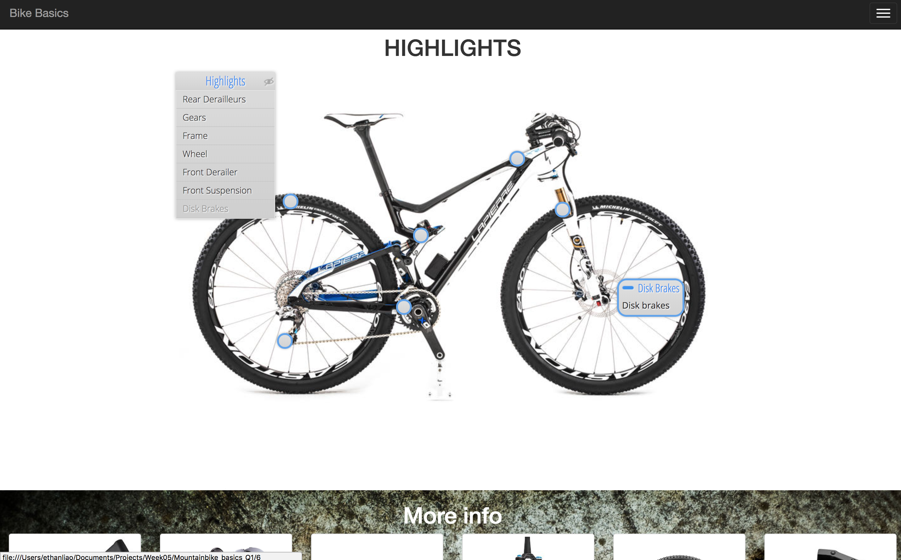
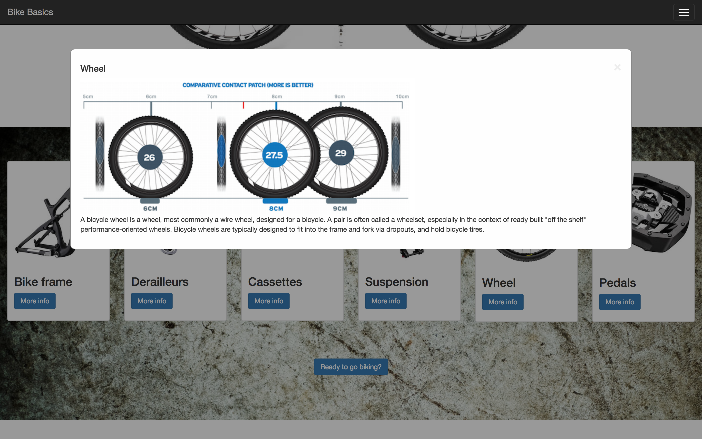
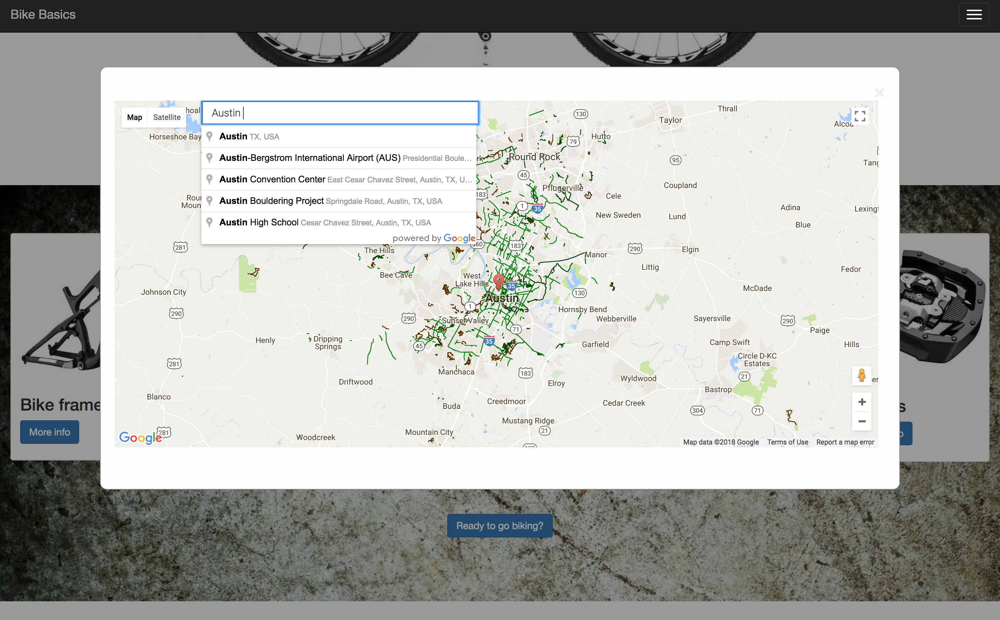

# Mountain Bike Basics

### Deployed Site
[Mountain Bike Basics](https://ethanl-mtb-basics.surge.sh)

### Motivation

This idea all started when I was researching about mountain bike maintenance for my bike. After some research I couldn't find any intuitive websites that offered a simple pictorial description of bike parts. Most required you to read hundreds of lines of text.
So, after one month into learning about web development at Galvanize I turn my idea into reality. I wanted to make an interactive 3D model of a mountain bike where you can click on parts and a part description will pop up.

### Technology used

* [Jquery](https://jquery.com/) - Front-end Javascript library
* [Google maps API](https://developers.google.com/maps/get-started/) - Google maps integration
* [Wikipedia API](https://www.mediawiki.org/wiki/API:Main_page) - Wikipedia API for pulling bike information
* Image Sprites plugins - Powers the 3D rotating bikes

